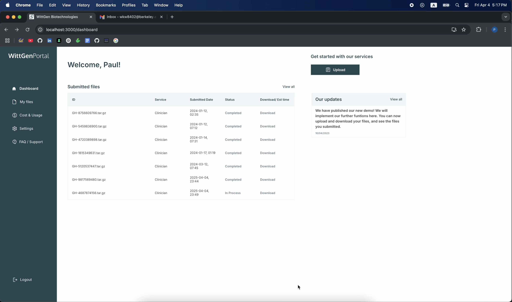

# 🧬 WittGen Portal

A secure, cloud-integrated web portal that allows authenticated users to upload genomic data files for ML-based cancer cell diagnosis. Built with React and AWS.

## 🚀 Features

- 🔐 **User Authentication** — Secure login via AWS Cognito.
- 📂 **File Upload to S3** — Upload multiple DNA files to S3 with automatic compression using Lambda.
- 🧠 **Application Status Tracking** — Real-time status updates across five stages: Uploaded, Processing, ML Diagnosis, Reviewed, Completed.
- 📬 **Email Notification** — AWS SNS sends email alerts upon file upload and status updates.
- 📊 **User Dashboard** — View, track, and download reports for submitted files.

## 📺 Demo Video
Check out a short walkthrough of the file upload and dashboard features: 

## 🧱 Tech Stack

- **Frontend**: React, TypeScript
- **Backend**: AWS Lambda, S3, SNS, DynamoDB, Cognito
- **Infra**: IAM role-based security, UUID-based file organization

## 🧠 What I Learned

- How to build scalable, secure serverless pipelines with AWS
- Using IAM roles instead of hardcoded credentials for best security practices
- Designing real-time, user-centered application flows with dynamic dashboard updates

## 🧪 Key Code Highlights

- Upload logic: `uploadFolderToS3.js`
- Dashboard view & status tracking: `Dashboard.jsx`, `InProgress.jsx`
- File metadata storage and submission: `DatabaseInput1.jsx`, `MyFiles1.jsx`
- Secure credentials setup: IAM role config & Cognito integration

## 🤝 About This Project
Originally developed for WittGen Biotechnologies as part of a pilot program supporting genomic researchers and clinicians. This repo demonstrates key concepts and code with sensitive content removed for privacy.

---

**🔗 Contact:** Paul Kyung-Wan Woo | [LinkedIn](https://linkedin.com/in/kyungwanwoo) | [GitHub](https://github.com/wkw8402)
